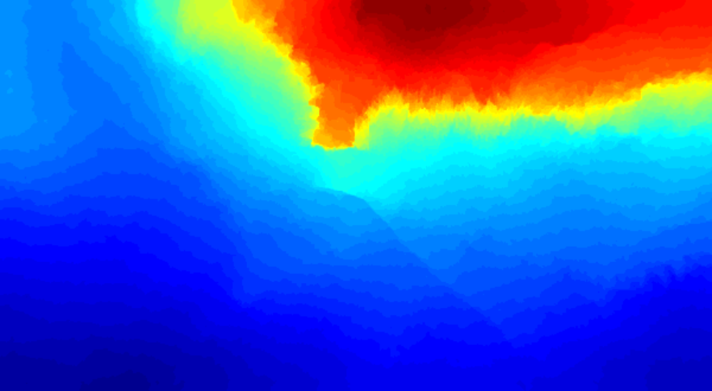
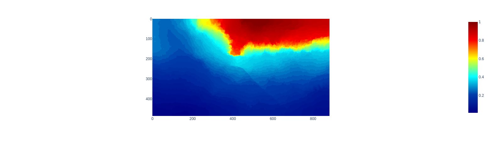
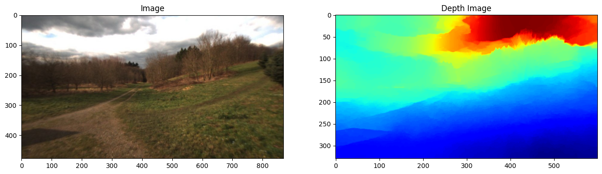
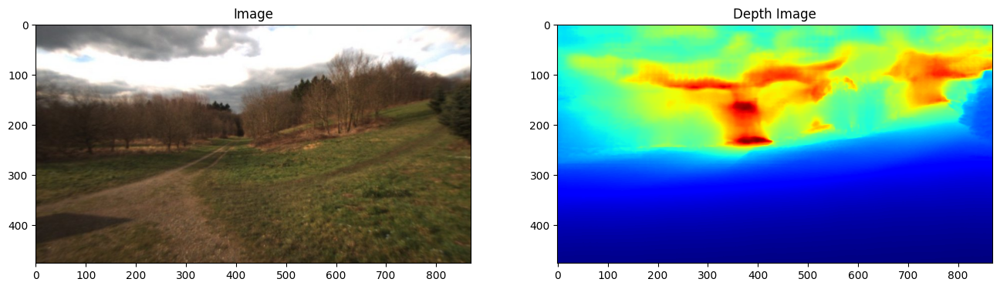

---
tags:
  - anytraverse
---
# Analysis of Freiburg Forest Data

## Sample Image

- The pixels do not have a single value (scalar).
- The depth images in the dataset are **RGB** images.
- Need to convert from *RGB to scalar*.

> [!important] How to Proceed?
> - Convert pixels from **RGB** to **scalar** values.
> - The theme is *jet*. See what RGB -> Scalar conversion applies.
> - *Apply the inverse transformation used to apply the jet theme on an array of scalar values*.

## Analysis

### Steps

- [x] Convert the image from RGB to scalar values.
	- [x] Guess the colormap (theme)
	- [x] Use `matplotlib` with a custom function to do the inverse of the colormap onto the RGB image.
- [x] Plot and see the scale of the values.
	- [x] Min value?
	- [x] Max value?
- [ ] Init the *metric* depth estimation model and get the output.
- [ ] **How to compare the output of metric model with the converted depth image from dataset?**

### Observation

- The colormap used was *Jet* (pretty popular)
- The range of values on applying the inverse theme
	- **Min:** `0.00`
	- **Max:** `1.00`

> [!help] Can you Compare Relative Depth with Metric Depth?
> **NO.**
> Use the single channel depth images from `depth_gray/` folder in the Freiburg dataset.

## Single Channel Depth Image (Gray)

- Picked the same image from `depth_gray`
- Colormap applied is *Jet*.
- Range of values:
	- **Min:** `0`
	- **Max:** `255`
- This is still *relative*, though.

## Single Channel Depth Image

- Picked the same depth image from `depth_1ch`
- Range of values:
	- **Min:** `0`
	- **Max:** `255`
- This is still *relative*!.

> [!help] What about NIR?
> - NIR stands for Near Infra-Red imaging.
> - It captures infrared light in the camera.
> - It is used to differentiate between different surfaces which have different reflectivity to IR light.
> 	- Water has very low reflectivity for IR; appears darker.
> 	- Vegetation has very high reflectivity for IR; appears brighter.

## RGB to RGB Comparison

### Depth Estimation Model

- Initialized the *Depth Anything v2 (Metric Outdoor Large)* model.
- Ran inference on the same image again.

