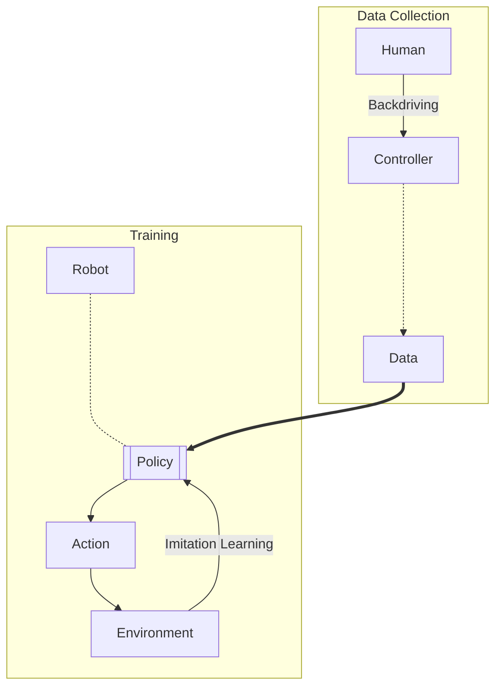
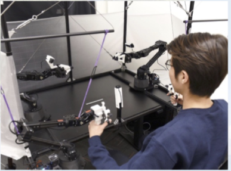
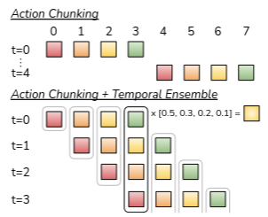

---
tags:
  - projects/dl-rl
  - resources/reading
  - area/humanoid
---
> [!quote] Abstract
> *Fine manipulation* tasks, such as threading cable ties or slotting a battery, are notoriously difficult for robots because they require *precision*, *careful coordination of contact forces*, and closed-*loop visual feedback*. Performing these tasks typically requires high-end robots, accurate sensors, or careful calibration, which can be expensive and difficult to set up. Can learning enable low-cost and imprecise hardware to perform these fine manipulation tasks? We present a low-cost system that performs end-to-end imitation learning directly from real demonstrations, collected with a custom teleoperation interface. Imitation learning, however, presents its own challenges, particularly in high- precision domains: errors in the policy can compound over time, and human demonstrations can be non-stationary. To address these challenges, we develop a simple yet novel algorithm, **Action Chunking with Transformers (ACT)**, which ==learns a generative model over action sequences==. ACT allows the robot to learn 6 difficult tasks in the real world, such as opening a translucent condiment cup and slotting a battery with 80-90% success, with only 10 minutes worth of demonstrations. [Project Website](https://tonyzhaozh.github.io/aloha/)

---

# Introduction

## Problems with Existing Systems

- Existing systems use *high-end robots and sensors* which are very **expensive**.
- Low cost systems are *inevitably imprecise*. Planning and sensing more challenging.

## Approach to Address Issues

- Incorporate **learning** into the system.
- Humans perform tasks by learning from *closed-loop visual feedback* and actively compensating for errors.
- Mapping RGB pixels directly to actions:
	- Visual feedback through commodity cameras.
	- *Pixel to action* formulation sutiable for fine manipulation tasks.
	- Objects have *complex physical properties*; **learning manipulation policy easier** than modelling the whole environment.
- Easier to train policy for simpler actions to perform fine tasks than modelling env accurately.

## Challenges

- End-to-end policy depends heavily on training data distribution. Fine manipulation - High quality ground truth data required.
- **Human teleoperation** provides very high quality data for training the policy. Presents high value due to *human dexterity*.

## Proposed Solution



### Teleoperation for Data Collection



- Two sets of low-cost robot arms.
- [Joint space mapping](https://www.youtube.com/watch?v=L2JP-_mdVVo) used for teleop.
- Whole setup costs < $20k.
- Human can teleop to perform fine tasks like
	- Threading a zip tie
	- Juggling a ping pong 🏓 ball
	- Assembling chain in a NIST board (???)

### Imitation Learning Algorithm


- **Challenge:** Fine tasks very challenging, even with high quality data. Small errors in predicted action can incur large differences in state (*compounding error!*)
- **Solution:** ==Action Chunking==
	- Derived from concept in psychology
	- Break actions into *sequences*.
	- Group sequences as *chunks*.
	- Execute in *one unit*.

#### Policy

- **Output:** Target *joint positions* for the next $k$ timesteps.
- Reduces effective horizon of the task by $k$-fold.
	- *Multiple actions* predicted simultaneously, **stable trajectory**, less chance of veering off course.
	- Allows for *smoother execution* of complex tasks.
	- This mitigates the problem of compounding errors.
	- Also takes care of *temporally corellated confounders* (unknown variables) such as pauses in human demonstrations.
- **Temporal Ensembling:**
	- Queries the policy more frequently.
	- Averages across overlapping action chunks.
- Action chunking is implemented with **transformers**.
	- Transformers designed for *sequence modelling*.
	- Trained as *conditional variational auto-encoder (CVAE)* to capture variability in human data.
- The method named ==Action Chunking with Transformers (ACT)==.

## Key Contributions

- Low cost system for learning fine manipulations, comprising:
	- **Teleop** system
		- Low cost
		- High precision
		- Rich contact tasks - Tasks which require lots of *contact* with the object
	- Novel **imitation learning** algorithm
- Method employed to learn 6 tasks
- Achieves 80-90% success with only 10 min or 50 demonstration trajectories from human.

---

# ALOHA

> [!info] ALOHA
> **A Low-Cost Open-Source Hardware System** for Bimanual Teleoperation
> 
> ### Principles:
> 1. Low-Cost
> 2. Versatile
> 3. User-Friendly
> 4. Repairable
> 5. Easy-to-Build
> 
> [Fine-Grained-Bimanual-Operation_Zhao, page 3](resources/Fine-Grained-Bimanual-Operation_Zhao.pdf#page=3&selection=88,6,137,29)

## Joint-Space Mapping instead of Task-Space

> [!tldr] TLDR;
> 
> Instead of mapping hand pose of human operator *(task-space mapping)*, direc *joint-space mapping* from smaller "leader" robot (WidowX) to larger "follower" robot (ViperX).
> 
> [Fine-Grained-Bimanual-Operation_Zhao, page 3](../resources/Fine-Grained-Bimanual-Operation_Zhao.pdf#page=3&selection=160,0,170,32)

### Benefits of Joint-Space Mapping

1. Fine manipulation requires operating the [robot near singularities](../resources/Robot%20Singularities.md).
	- Off the shelf *inverse kinematics (IK)* often fails in this setting.
	- Joint-Space Mapping :luc_arrow_right: high bandwidth control, less computation.
2. Weight of the leader robot prevents the operator from moving too fast, dampens vibrations.

---

# Action Chunking with Transformers

## Training of ACT

- Collect human demonstration data using [ALOHA](#ALOHA).
- Actions = *Joint positions of leader robot*.
- Observation
	- Current *joint positions of follower robot*.
	- *RGB image* feed from 4 cameras.
- ACT is trained to **predict the sequence of future actions**, given the current observations (Markov assumed).
- Sequence of *future actions* :luc_arrow_right: **Target joint positions of follower robot**. Joint positions here, are considered for both arms of the follower.
- Intuitively, the ACT tries to *imitate* what a human operator would do, in **$k$ future time steps**, given the current observations.

## Action Chunking and Temporal Ensemble


> [!info] Action Chunking
> Inspired from the concepts of neuroscience, action chunking refers to the process of grouping individual actions into chunks and then executing those chunks as units.
> 
> ```mermaid
> flowchart TD
>   A[Complex Action] --> a1 & a2 & a3 & a4 & a5 & a6 & a7
>   a1 & a2 & a3 -..-> c1[[Chunk 1]] 	
>   a4 & a5 -..-> c2[[Chunk 2]] 	
>   a6 & a7 -..-> c3[[Chunk 3]]
>   subgraph Execution
> 	  direction LR
> 	  start((Start)) ==> c1 ==> c2 ==> c3 ==> done((Done)) 	
>   end
> ```


- To combat the challenge of **compounding errors** in *pixel to action* imitation learning, need to *reduce the effective horizon of long trajectories*.
- **Chunk size** fixed to be $k$.
	- Every $k$ steps, the *agent receives an observation*.
	- Then the agent *generates the next $k$ actions*, then executes them in sequence.
- This results in a $k$-fold reduction in the effective horizon for the task.

> The policy models $\pi_{\theta}(a_{t:t + k} \mid s_t)$, not just $\pi_{\theta}(a_{t} \mid s_t)$

- Chunking can also help model **Non-Markovian behaviours** in human demos, e.g., *Pauses* in the middle of the demo.

### Stabilization of Actions with Temporal Ensemble

 ^647afb

> [!help] Why Stabilization?
> - Naive implementation of ACT is *sub-optimal*.
> - New env every $k$ steps :luc_arrow_right: **jerky robot motion**.
> - Due to discrete switching between execution and observation.
> - Need to make it **smooth**.

- To avoid discrete switching, $\pi_{\theta}(a_{t:t + k} \mid s_t)$ queried at every $s_t$.
- This makes **different action chunks overlap**.
- At a given time step, there will be *more than one predicted action*. See [Figure](#^647afb).
- Action to be executed $a_t$ computed from the different actions by exponentially weighted summation.
  $$w_i = \exp(-m \cdot i)$$
  $$a_t = \sum_{i = 0}^{\min(t, k)}{w_i \cdot a^{(i)}_t}$$
  where
  - $w_0$ is the oldest action
  - $m$ governs the speed at which new observations are incorporated. Smaller $m$ means faster incorporation.
