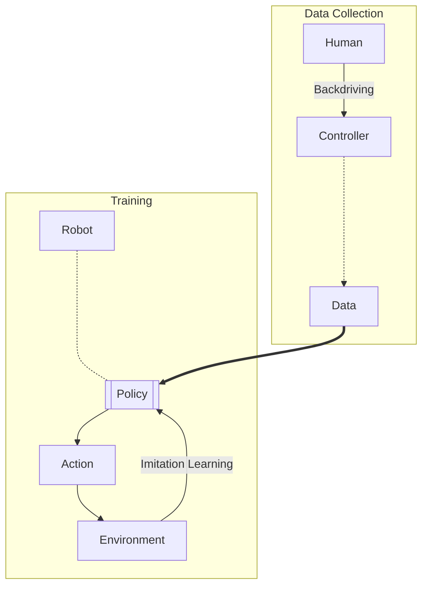

---
tags:
  - dlrl
  - reading
---
> [!quote] Abstract
> *Fine manipulation* tasks, such as threading cable ties or slotting a battery, are notoriously difficult for robots because they require *precision*, *careful coordination of contact forces*, and closed-*loop visual feedback*. Performing these tasks typically requires high-end robots, accurate sensors, or careful calibration, which can be expensive and difficult to set up. Can learning enable low-cost and imprecise hardware to perform these fine manipulation tasks? We present a low-cost system that performs end-to-end imitation learning directly from real demonstrations, collected with a custom teleoperation interface. Imitation learning, however, presents its own challenges, particularly in high- precision domains: errors in the policy can compound over time, and human demonstrations can be non-stationary. To address these challenges, we develop a simple yet novel algorithm, **Action Chunking with Transformers (ACT)**, which ==learns a generative model over action sequences==. ACT allows the robot to learn 6 difficult tasks in the real world, such as opening a translucent condiment cup and slotting a battery with 80-90% success, with only 10 minutes worth of demonstrations. [Project Website](https://tonyzhaozh.github.io/aloha/)

---

# Introduction

## Problems with Existing Systems

- Existing systems use *high-end robots and sensors* which are very **expensive**.
- Low cost systems are *inevitably imprecise*. Planning and sensing more challenging.

## Approach to Address Issues

- Incorporate **learning** into the system.
- Humans perform tasks by learning from *closed-loop visual feedback* and actively compensating for errors.
- Mapping RGB pixels directly to actions:
	- Visual feedback through commodity cameras.
	- *Pixel to action* formulation sutiable for fine manipulation tasks.
	- Objects have *complex physical properties*; **learning manipulation policy easier** than modelling the whole environment.
- Easier to train policy for simpler actions to perform fine tasks than modelling env accurately.

## Challenges

- End-to-end policy depends heavily on training data distribution. Fine manipulation - High quality ground truth data required.
- **Human teleoperation** provides very high quality data for training the policy. Presents high value due to *human dexterity*.

## Proposed Solution

### Teleoperation for Data Collection

- Two sets of low-cost robot arms.
- [Joint space mapping](https://www.youtube.com/watch?v=L2JP-_mdVVo) used for teleop.
- Whole setup costs < $20k.
- Human can teleop to perform fine tasks like
	- Threading a zip tie
	- Juggling a ping pong 🏓 ball
	- Assembling chain in a NIST board (???)

### Imitation Learning Algorithm

- **Challenge:** Fine tasks very challenging, even with high quality data. Small errors in predicted action can incur large differences in state (*compounding error!*)
- **Solution:** ==Action Chunking==
	- Derived from concept in psychology
	- Break actions into *sequences*.
	- Group sequences as *chunks*.
	- Execute in *one unit*.

#### Policy

- **Output:** Target *joint positions* for the next $k$ timesteps.
- Reduces effective horizon of the task by $k$-fold.
	- *Multiple actions* predicted simultaneously, **stable trajectory**, less chance of veering off course.
	- Allows for *smoother execution* of complex tasks.
	- This mitigates the problem of compounding errors.
	- Also takes care of *temporally corellated confounders* (unknown variables) such as pauses in human demonstrations.
- **Temporal Ensembling:**
	- Queries the policy more frequently.
	- Averages across overlapping action chunks.
- Action chunking is implemented with **transformers**.
	- Transformers designed for *sequence modelling*.
	- Trained as *conditional variational auto-encoder (CVAE)* to capture variability in human data.
- The method named ==Action Chunking with Transformers (ACT)==.

## Key Contributions

- Low cost system for learning fine manipulations, comprising:
	- **Teleop** system
		- Low cost
		- High precision
		- Rich contact tasks - Tasks which require lots of *contact* with the object
	- Novel **imitation learning** algorithm
- Method employed to learn 6 tasks
- Achieves 80-90% success with only 10 min or 50 demonstration trajectories from human.

---

# ALOHA

> [!info] ALOHA
> **A Low-Cost Open-Source Hardware System** for Bimanual Teleoperation
> 
> ### Principles:
> 1. Low-Cost
> 2. Versatile
> 3. User-Friendly
> 4. Repairable
> 5. Easy-to-Build
> 
> [Fine-Grained-Bimanual-Operation_Zhao, page 3](resources/Fine-Grained-Bimanual-Operation_Zhao.pdf#page=3&selection=88,6,137,29)
