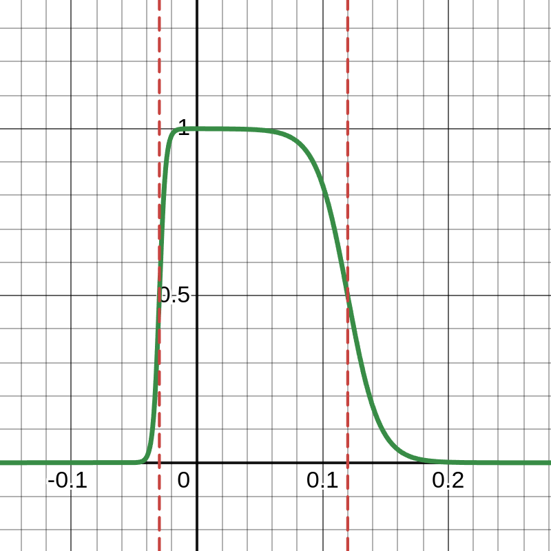

---
tags:
  - anytraverse
---
# Why detect negative obstacles?

- What to do when crater encountered?
- What to do when steep cliff? (seen near IISERB logo, Forest nursery)

# How to detect negative obstacles?

## Modify Existing Height Scoring

- Existing height scoring function is $$\Pr[\text{Traversable}] = \sigma(-\alpha \cdot (z - z_{\text{thresh}}))$$
- Can modify to make it symmetric about $x = 0$?

## Function Designing

- Height scoring function not necessarily symmetric around $y$-axis
- The plot above shows the height scoring function to detect negative obstacles.

## New Height Scoring Design

These were the equations used in earlier design
$$\begin{align}
	\sigma(x) &= \frac{1}{1 + \exp(-x)} \tag{1.1} \\
	p(z) &= \sigma(-\alpha \cdot (z - z_{\text{thresh}})) \tag{1.2} \\
\end{align}$$

We use (1.1) and (1.2) to construct a new piecewise height scoring function as shown below

$$\begin{align}
	p^{+}(z) &= \sigma\left(-\alpha^{+} \cdot (z - z^{+}_{\text{thresh}})\right) \tag{2.1} \\
	p^{-}(z) &= \sigma\left(\alpha^{-} \cdot (z + z^{-}_{\text{thresh}})\right) \tag{2.2} \\ \\
	p(z) &= \begin{cases}
		p^{+}(z),\; \text{if } z \ge 0 \\
		p^{-}(z),\; \text{if } z \lt 0
	\end{cases} \tag{2}
\end{align}$$
where,
- $\alpha^{+} \gt 0$ is the sharpness parameter for the cutoff for $z \ge 0$
- $\alpha^{-} \gt 0$ is the sharpness parameter for the cutoff for $z \lt 0$
- $z^{+}_{\text{thresh}} \gt 0$ is the thresholding height for $z \ge 0$
- $z^{-}_{\text{thresh}} \gt 0$ is the thresholding height for $z \lt 0$

> [!NOTE] Caveats
> - The property of the function is such that it is not smooth at $z = 0$ (but the parameters can be tuned to make it practically smooth).
> - Weird beaviour might occur around $Z = 0$
>   $$\underset{z \rightarrow 0^-}{\lim}\ p(z) \ne \underset{z \rightarrow 0^+}{\lim}\ p(z)$$
>   where the difference between the LHS and RHS might not be negligible enough to avoid.
> - **Conclusion:** Tune parameters carefully before deployment.

> [!success] Results: Improved!
> **MIoU:** `0.855`
> 
> - [ ] Choose images where negative obstacle detection works visually better than the normal method.
> - [ ] Show some nice plots
