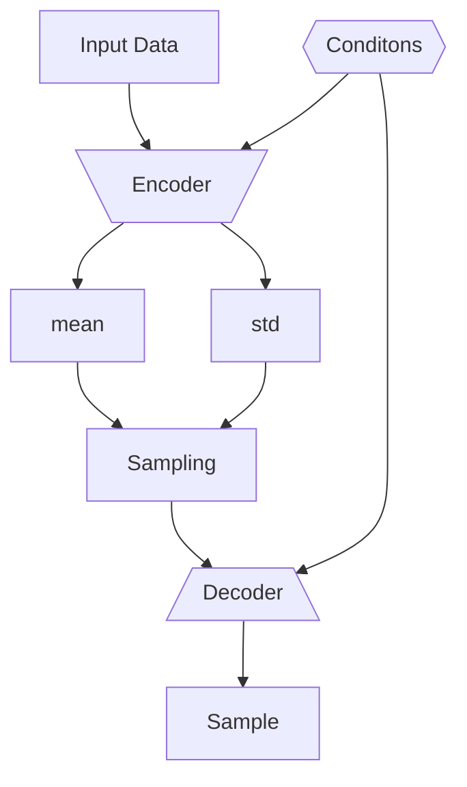

---
tags:
  - resources/deep-learning
  - resources/reading
---
> [!help] Resources
> - [Deepgram, *Conditional Variational Autoencoders*](https://deepgram.com/ai-glossary/conditional-variational-autoencoders)
> - [Towards Data Science, *Understanding Conditional Variational Autoencoders*](https://towardsdatascience.com/understanding-conditional-variational-autoencoders-cd62b4f57bf8)
> - :luc_file_text: [Zhang et al., Conditional Variational Autoencoders for Learned Image Generation](Conditional-Variational-Autoencoder.pdf)
> - :luc_file: [Variational Autoencoders](Variational%20Autoencoders.md)

# What are CVAEs?

- Used to *generate entirely new samples of data* from given conditions
- Can also *reconstruct* data
- ==Generate data using conditional inputs==, increasing the flexibility and capabilities of these models.
- Follows the **encoder decoder** architecture.

